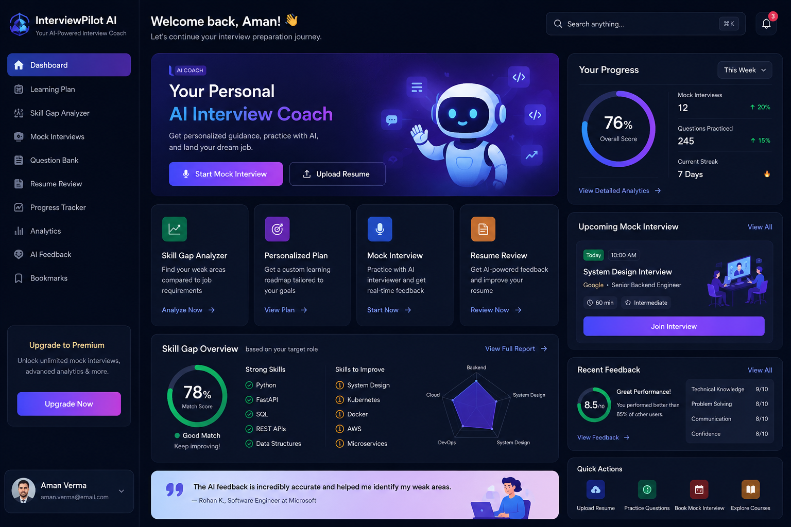

# AI-Interview-Coach-Using-Langrpah-
InterviewPilot-AI is a lightweight Interview coaching app. This repo now contains a simplified backend (FastAPI) that exposes a single chat endpoint and a minimal frontend SPA that calls it.

Quick start
-----------

1. Backend (recommended: create and use a virtual environment)

```powershell
cd backend
# create venv (one-time)
python -m venv .venv
# activate (PowerShell)
Set-ExecutionPolicy -ExecutionPolicy Bypass -Scope Process
. .\.venv\Scripts\activate
pip install -r requirements.txt
uvicorn app.main:app --reload --host 0.0.0.0 --port 8000
```

2. Frontend

Open `frontend/index.html` in a browser or serve it from any static server. When the backend runs on localhost:8000, the page will POST to `/api/interview/chat`.

3. Chat API

POST `/api/interview/chat` form fields: `profile` (string), `target_role` (string), `history` (string, optional).

Notes
-----
- The backend contains a simple `MockInterviewer` that delegates to `LLMService`. Ensure you provide LLM credentials in `backend/.env` if you plan to use OpenAI/Groq providers.
- This is intentionally minimal to be easy to run and extend.

